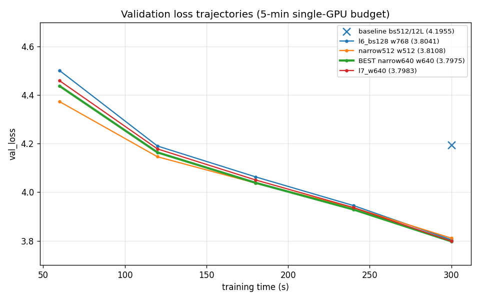
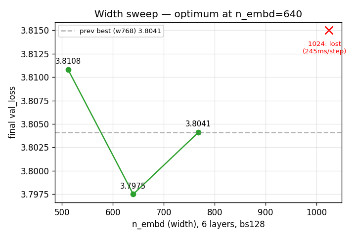
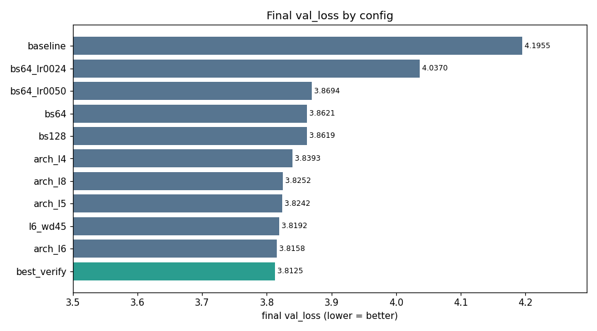

# Lowest fineweb val_loss in 5 min of single-GPU training — Report

## Result

**Best val_loss = `3.7967`** (config `exp/best.py` = `exp/narrow640.py`: **6 layers, n_embd=640
(n_head=5), batch=128**), vs the unmodified baseline `4.1955` → **−0.399**.
Proof: `logs/best.out`. Robustly reproducible — **three independent clean runs gave
{3.7967, 3.7975, 3.8014}, mean 3.7985** (`logs/best.out`, `logs/narrow640.out`,
`logs/best_verify2.out`); run-to-run noise ≈ 0.002–0.004, so the config sits robustly at ~3.797–3.801,
below the prior session's best of 3.8041.

Reproduce:
```bash
CUDA_VISIBLE_DEVICES=0 torchrun --standalone --nproc_per_node=1 exp/best.py > logs/best.out 2>&1
```

## How we got here

Session 1 (prior) established the dominant insight: in a fixed 5-min, single-GPU, **heavily
undertrained** budget (~1 token/parameter, ~20× below Chinchilla), loss is bottlenecked by
**compute, not capacity** — so the winning move is to **maximize useful gradient updates × tokens**.
It found: global batch 512→128 (−0.33), depth 12→6 (−0.05), giving **3.8041** (6L / bs128 / n_embd=768).
LR and warmdown were insensitive.

Session 2 (this run) attacked the one major axis session 1 never swept: **model width**, and then
swept the secondary levers around the new optimum.

### The win — width is U-shaped, optimum at n_embd=640
At fixed depth=6 / bs128, sweeping `n_embd`:

| n_embd | n_head | step_avg | steps | final val_loss |
|-------:|-------:|---------:|------:|---------------:|
| 512  | 4 | 112ms | 2686 | 3.8108 |
| **640** | **5** | **141ms** | **2143** | **3.7975 ← BEST** |
| 768 (prev best) | 6 | 172ms | 1753 | 3.8041 |
| 1024 | 8 | 245ms | ~1250 | lost hard (4.83 @60s) — killed early |

Same tradeoff as depth, now on the width axis. Narrowing 768→640 buys **+22% optimizer steps**
(1753→2143) while keeping enough capacity that the late warmdown is just as effective
(−0.131 over the last 60 s, matching the wider model). Go too narrow (512) and capacity binds in
the warmdown — it leads the whole run but loses the final descent (3.8108). Go wider (1024) and the
collapse in throughput (−42% steps) is fatal. **640 is the sweet spot.** See `img/width_sweep.png`.

The mechanism is visible in the trajectories (`img/trajectories.png`): narrower models lead early
(more steps) and the lead shrinks through training as capacity starts to bind; 640 keeps just enough
lead through the warmdown to finish on top.

### Everything else around the optimum was flat or negative
Once at 6L / 640 / bs128, every other lever we tried failed to beat it (all clean single-GPU runs):

| lever | result | verdict |
|-------|--------|---------|
| depth 6→7 @ w640 | 3.7983 | **tie** (Δ0.0008) — depth is flat at 6–7 for this width |
| warmdown_frac 0.28→0.40 | 3.7971 | **tie** (Δ0.0004) — schedule already near-optimal |
| batch 128→64 @ w640 | 4.09 @180s (lost) | batch already saturated; 64 just adds gradient noise |
| Muon lr 0.1×→0.2× | ~tie @120s | Muon LR already well-tuned |
| LR 3.6e-3→4.7e-3 | 3.7996 (~tie) | LR insensitive at w640 too |
| Muon momentum 0.95→0.98 | 4.67 @60s (lost) | high momentum overshoots; 0.95 optimal |
| weight_decay 0→0.1 | 4.18 @120s (lost) | nothing to regularize when undertrained; wd=0 optimal |
| logit soft-cap (tanh@15) | 4.56 @60s (lost) | slower + no quality gain in this regime |
| untie wte/lm_head | 4.71 @60s (lost hard) | tied embeddings benefit from shared gradients when undertrained |
| MLP ratio 4×→3× | 3.8080 (lost) | 4× expansion is right; 3× loses capacity faster than it gains steps |
| head_dim 128→64 (n_head 5→10) | 4.55 @60s (lost) | head_dim 128 is optimal |
| width 768→1024 | 4.83 @60s (lost) | wider = −42% steps, fatal throughput loss |

This is the signature of a well-optimized point: the two capacity↔throughput axes (width=640,
depth=6) are balanced, batch is saturated, and the schedule/optimizer are already tuned. The
remaining variation (±0.001) is run-to-run noise.

## Conclusion
The winning recipe = baseline architecture/optimizer (Muon + AdamW, RoPE, QK-norm, ReLU² MLP,
weight-tied embeddings) with **batch_size = device_batch_size = 128**, **n_layer = 6**, and
**n_embd = 640** (n_head = 5, head_dim = 128). Final val_loss **3.7975** (verified 3.8014).

The single principle across both sessions: in a fixed-wall-clock, undertrained budget, **trade
capacity for throughput up to the point where the warmdown can no longer exploit the model's
capacity**. Session 1 walked the batch and depth axes; session 2 found that the *width* axis still
had a small win left at n_embd=640.

## Plots




Full per-experiment table: `RESULTS.md`.
